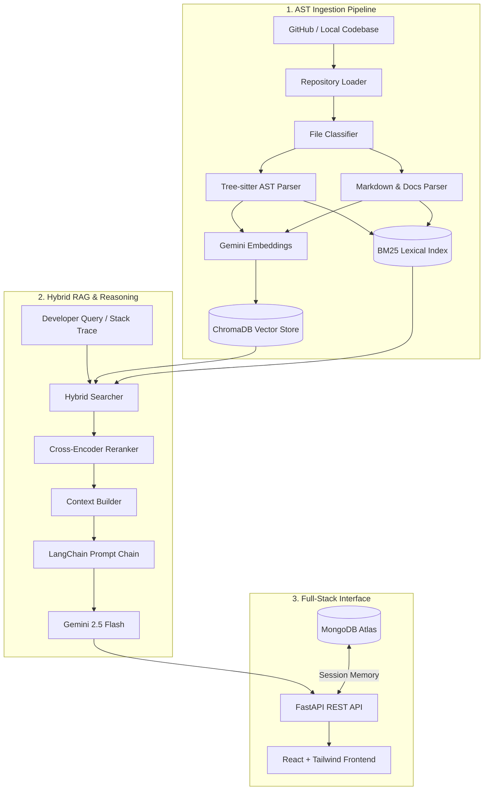

# 🧠 Software Engineering Knowledge & Debugging Platform

[](https://python.org)
[](https://fastapi.tiangolo.com)
[](https://react.dev)
[](https://www.trychroma.com)
[](https://ai.google.dev)
[](LICENSE)

An AI-powered codebase intelligence and automated debugging platform for full-stack repositories. It ingests source code, architecture diagrams, technical documentation, API specifications, and git history into a unified **Hybrid RAG** engine, enabling grounded code navigation and automated root-cause diagnostics without hallucinations.

The platform is configured with the **[Grandel Hotel Booking Platform](https://github.com/Prjhage/Grandel)** codebase as its primary target repository.

---

## ✨ Key Features

- **🔍 Hybrid Retrieval Engine**: Combines dense vector search (`Gemini Embeddings` + `ChromaDB`) with sparse keyword matching (`BM25`) and reciprocal rank fusion for pinpoint recall.
- **🌳 AST-Aware Syntax Chunking**: Employs `Tree-sitter` (JavaScript & Python) to parse files along syntactic boundaries—extracting intact functions, class declarations, and docstrings instead of arbitrary character splits.
- **🐞 Automated Root-Cause Debugger**: Accepts error messages, failing endpoints, and expected vs. actual behavior to surface suspected failure causes, evidence files, and step-by-step investigation plans.
- **💬 Multi-Turn Session Memory**: LangChain prompt orchestration backed by MongoDB Atlas to maintain conversational context across follow-up queries.
- **📌 Strict Code Grounding**: Enforces source file and route citations (`Backend/routes/bookings.js`, `POST /listings/:id/book/initiate`) while flagging any speculative logic with `[INFERENCE]`.
- **⚡ Modern Responsive UI**: Glassmorphic dark-mode dashboard built with React 19, Vite, Tailwind CSS v4, and Lucide icons.

---

## 🏛️ System Architecture



---

## 📁 Repository Structure

```text
Software-Engineering-Knowledge-Debugging-Platform/
├── backend/
│   ├── app/
│   │   ├── api/          # FastAPI routers (chat, debugging, repository, search)
│   │   ├── core/         # Settings and MongoDB connection manager
│   │   ├── ingestion/    # Tree-sitter AST parser, chunker, and GitHub loader
│   │   ├── memory/       # MongoDB session-based chat history
│   │   ├── prompts/      # LangChain grounding, answer, and debugging prompts
│   │   ├── rag/          # Hybrid search (ChromaDB + BM25), reranking, context
│   │   ├── schemas/      # Pydantic models for chat, debug, and retrieval
│   │   └── services/     # Orchestrators for Q&A, debugging, and Gemini LLM
│   ├── requirements.txt  # Python backend dependencies
│   └── .env.example      # Backend environment template
├── frontend/
│   ├── src/
│   │   ├── components/   # ChatWindow, MessageBubble, DebugForm, Navbar, Sidebar
│   │   ├── context/      # React ChatContext and session state
│   │   ├── pages/        # ChatPage, DebugPage, RepositoryPage
│   │   └── services/     # Axios API client with Vite proxy
│   ├── package.json      # Frontend dependencies (React, Tailwind, Framer Motion)
│   └── vite.config.js    # Vite configuration with /api backend proxy
├── data/                 # ChromaDB persistence & local file cache (git-ignored)
├── .gitignore            # Security exclusions for keys, venvs, and databases
└── README.md
```

---

## 🚀 Quick Start

### 1. Prerequisites
- **Python**: `3.11+`
- **Node.js**: `18.0+`
- **MongoDB**: Local instance or MongoDB Atlas free-tier cluster
- **Google Gemini API Key**: From [Google AI Studio](https://aistudio.google.com/)

---

### 2. Backend Setup

```bash
# Navigate to backend directory
cd backend

# Create and activate virtual environment
python -m venv venv
# Windows:
.\venv\Scripts\activate
# Linux/macOS:
source venv/bin/activate

# Install dependencies
pip install -r requirements.txt

# Configure environment
cp .env.example .env
```

Edit `backend/.env` with your credentials:
```env
GEMINI_API_KEY=your_gemini_api_key_here
GITHUB_TOKEN=your_github_personal_access_token
GITHUB_REPO_OWNER=Prjhage
GITHUB_REPO_NAME=Grandel
MONGODB_URI=mongodb+srv://<username>:<password>@cluster.mongodb.net
CHROMA_PERSIST_DIRECTORY=../data/chroma
```

#### Run Ingestion & Start Server
```bash
# Ingest and index target repository
python -c "from app.ingestion.pipeline import IngestionPipeline; IngestionPipeline().run()"

# Start the FastAPI backend
uvicorn app.main:app --reload --port 8000
```
API runs at `http://127.0.0.1:8000` (Interactive Swagger docs at `/docs`).

---

### 3. Frontend Setup

```bash
# In a separate terminal, navigate to frontend directory
cd frontend

# Install Node dependencies
npm install

# Start Vite dev server
npm run dev
```
Frontend runs at `http://localhost:5173`.

---

## 💡 Example Inquiries

| Category | Sample Inquiry |
|---|---|
| **Architecture** | *"How does payment processing and signature verification work in Grandel?"* |
| **Routes & Logic** | *"Where is the user authentication and JWT middleware defined?"* |
| **Data Models** | *"Explain the MongoDB schemas and relationships between Users, Listings, and Bookings."* |
| **Root-Cause Debugging** | *"Why would `/listings/:id/book/verify` fail with an HMAC signature mismatch?"* |

---

## 🛡️ Security & Privacy

- All sensitive API keys (`GEMINI_API_KEY`, `GITHUB_TOKEN`, `MONGODB_URI`) are strictly kept inside local `.env` files and permanently excluded by `.gitignore`.
- Vector embeddings and cached repository trees reside locally in `data/chroma/` and are never committed.

---

## 📜 License

This project is licensed under the MIT License — see the [LICENSE](LICENSE) file for details.
